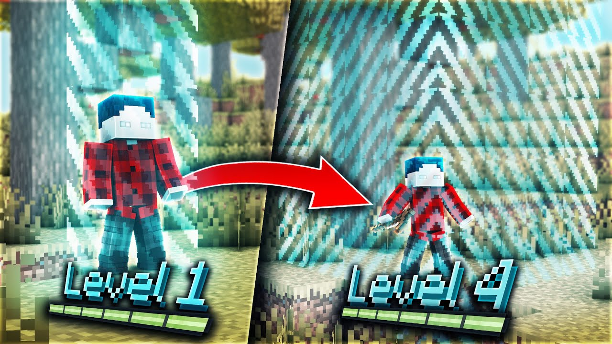

## Level = Border

A cross-platform Mod for the popular Minecraft project, where the border always has a radius equal to the player's
current experience level.

### Download

level-border is available on [**Modrinth**](https://modrinth.com/mod/level-border) (recommended) and [Curseforge]()
(only use it if you must).

### Supported mod loaders

first-class support:

- Fabric or Quilt *(recommended)*
- Paper

also supports:

- Forge

should also work with:

- Spigot or Bukkit
- clients which support mod loading, such as LabyMod

### License

This project is available under the [GPL-3.0](https://www.gnu.org/licenses/gpl-3.0.en.html) with a
[linking exception](LICENSE_LINKING.txt).
